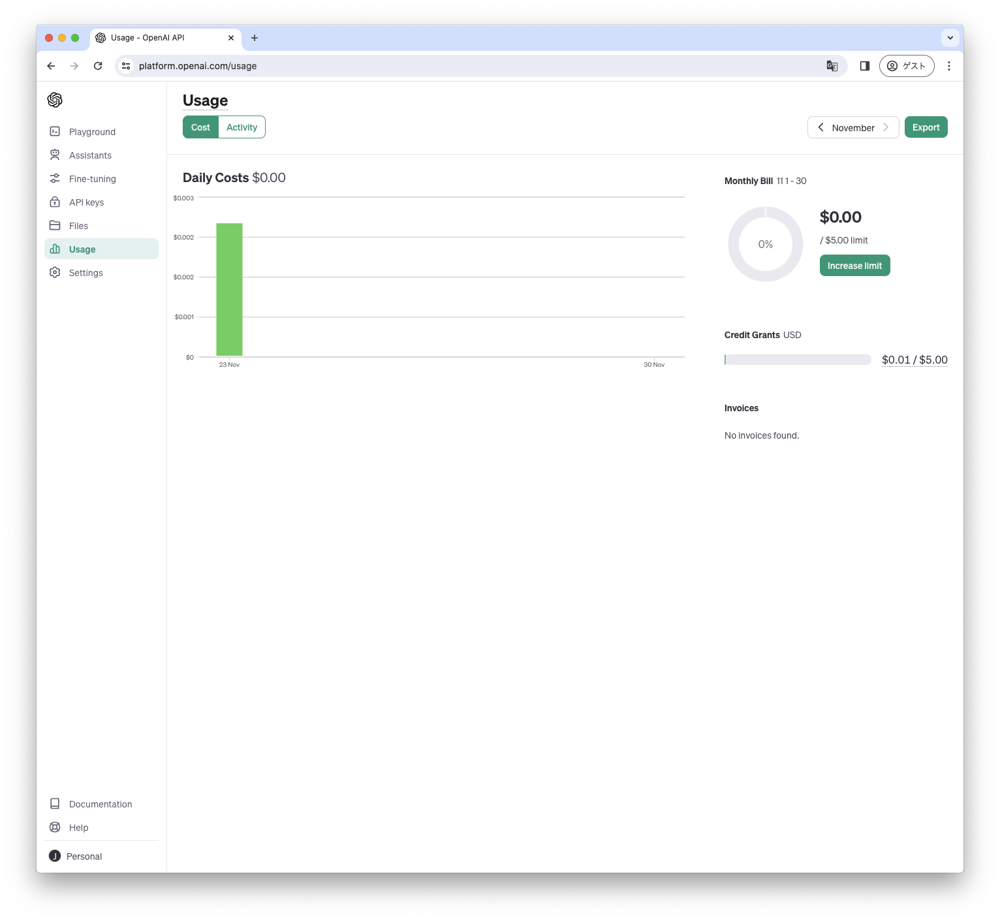

# APIキーの取得方法

1. [OpenAI](https://openai.com/)のサイトを開きます。

2. 右上メニューのLog inを選びます。

3. Don't have and account? の右横、Sign upを選びます。メールアドレスと設定したいパスワードを入力して、Continueをクリックします。

4. Verify your emailという画面になります。3.で設定したメールアドレスに「OpenAI - Verify your email
」というタイトルでメールが送られてくるはずなので、メール文中のVerify email addressのボタンをクリックします。

5. Tell us about youという画面が開くので、First NameとLast nameにそれぞれ、名前、名字を入力し、Birthdayの欄に生年月日を入力します。Terms(利用規約)とPrivacy Policy(プライバシーポリシー)に同意できれば、Agreeをクリックします。

6. ChatGPTかAPIを選ぶ画面になるので、APIの方を選びます。

7. 左上端のロゴにマウスカーソルを合わせ、開いたメニューよりAPI keysを選びます。

8. APIキーを作成するには、電話番号の認証が必要です。Start verificationのボタンをクリックします。

9. 電話番号を入力します。国番号の+81のあとには、電話番号の最初の0を抜いた番号を入力します。

10. 入力した番号あてにSMS(ショートメッセージ)が送られてきます。送られてきた6桁のコードを入力して電話番号を認証します。

11. 電話番号が認証されるとsecret key(APIキー)を作成できるようになります。Create new secret keyボタンを押し、secret key(APIキー)の名前を入力します。複数のAPIキーを使うときに見分けがつくよう適切な名前をつけておきましょう。例えばChatGPT2Scratchと名付けます。

12. secret key(APIキー)が発行されるので内容を控えておきます。キーの内容はこれ以降表示されないので、どこかにコピーする前に画面を閉じてしまわないように注意しましょう。

13. 以上の手順でAPIキーを発行することができます。左メニューのSettings > Billingを選ぶと課金状況が表示されます。以下のようにFree trialに続けてCredit remainingで表示されていれば、そこに表示されている金額分だけ無料で使用することができます。

14. View usageのボタンを押すと現在の使用状況がグラフで表示されます。もし、無料枠がなくなったあとも使い続けたい場合には、前の画面に戻り、Add payment detailsをクリックして、クレジットカードを登録することで使い続けることができます。

